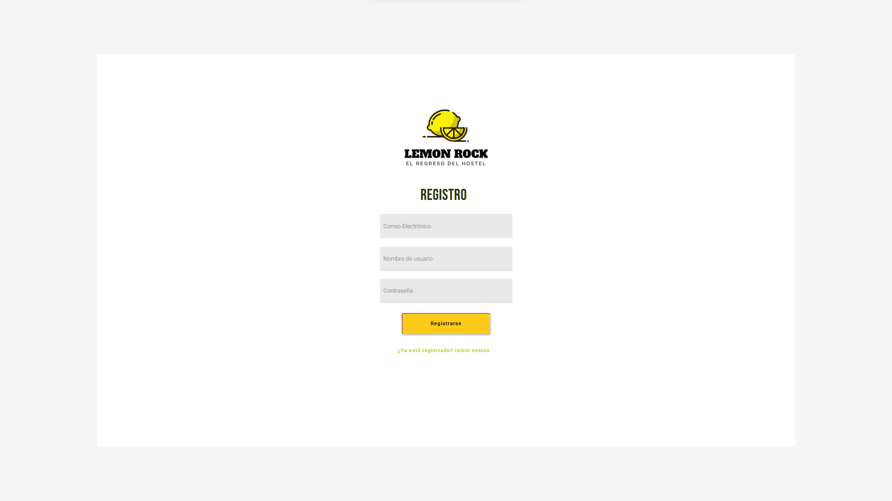

# DIU22
Prácticas Diseño Interfaces de Usuario 2021-22 (Tema: Hostels)

Grupo: DIU1_Estrellas.  Curso: 2021/22
Updated: 11/2/2022

Proyecto:
> El regreso del hostel

Descripción:

> Describa la idea de su producto en la práctica 2
Para esta práctica hemos pensado en reabrir el servicio de hostel original, aprovechando que el Lemon Rock dejó de serlo hace un tiempo. Para ello pensamos en realizar un microsite donde los usuarios puedan informarse de la reapertura de las habitaciones de hospedaje, además de poder reservar y encontrar ofertas inigualables.

Logotipo:
>>> Opcionalmente si diseña un logotipo para su producto en la práctica 3 pongalo aquí

Miembros
 * :bust_in_silhouette:   Sergio Hervás Cobo     :octocat:     
 * :bust_in_silhouette:  Andrés Merlo Trujillo     :octocat:
 * :bust_in_silhouette:  Javier Serrano Lucas     :octocat:

-----

# Proceso de Diseño

## Paso 1. UX Desk Research & Analisis

 1.a Competitive Analysis
-----

|Características | LemonRock | TOCHostels | BlueSockHostels |
|-|:-:|:-:|:-:
Eventos Culturales |Sí|No|No
Opción de habitaciones convencionales|No|Sí|Sí
Reserva Online|Sí|Sí|Sí
Wi-Fi|No|Sí|Sí
Disponibilidad de varios idiomas|No|Sí|Sí
Recepción 24 horas|No|No|Sí
Habitaciones adaptadas|No|No|Sí
Habitaciones femeninas|No|Sí|Sí
Bar/Cafetería|Sí|Sí|Sí
Restaurante|Sí|No|No
Cocina en la habitación|No|Sí|No
Lavadora|No|Sí|No
Taquillas|No|Sí|Sí
Ambiente identificativo|Sí|No|No
Redes Sociales|Sí|Sí|Sí
FAQ|No|Sí|No

>Teniendo en cuenta que el establecimiento Lemon Rock ya no es considerado un hostel (dejó de brindar este servicio hace un tiempo), creemos que es un lugar con una identidad y temática muy marcada (underground, indie…). La apariencia de la “marca” es realmente auténtica y define a la perfección el lugar.
Además, parece que se han reinventado correctamente haciendo del local un lugar con una experiencia única gracias a los eventos culturales que se realizan en ellos. Al ofrecer distintos servicios en el mismo local, lo consideramos un lugar multiusos donde puede haber desde una fiesta temática o concierto hasta una degustación de platos especiales, potenciado por las distintas salas y estancias que posee en su interior.
También aparenta ser un sitio moderno, joven y cómodo, donde una pareja o grupo de amigos pueden pasar un buen rato hablando y disfrutando del momento.
La página web sigue la misma línea y pretende plasmar todo lo mencionado hasta ahora: ser un sitio donde evadirse del exterior.

-----
>
**Rory Trey**
Para el primer personaje (Rory) hemos pensado en un hombre irlandés que vino a Granada por motivos laborales y le gustó tanto que ha decidido quedarse a vivir aquí. Además, ha encontrado el amor y eso le ha motivado aún más a permanecer en la capital. Como no lleva mucho tiempo en la ciudad, quiere conocer gente nueva y su carácter extrovertido le anima a salir por lugares con buen ambiente sólo o con su pareja.
-----
>
**Olga Patiño**
En cuanto a Olga, el segundo personaje, queríamos un enfoque distinto al anterior y elegimos la figura de una chica universitaria que está estudiando magisterio. Es sociable y siempre que sale es con su grupo de amigos de la carrera. No le gusta ir a las discotecas por el ruido y la muchedumbre.
-----
>
**Journey Map de Rory**
Para el primer journey map hemos pensado en el caso de alguien que quiere desconectar después de un duro día de trabajo. Al ser una persona nueva en la ciudad, aún no dispone de vehículo privado y se tiene que desplazar en transporte público. Consideremos realista este ejemplo pues Granada es una ciudad que atrae mucha gente del extranjero y el Lemon Rock tiene un ambiente muy amigable para ellos (música, fiestas temáticas…)
-----
>
**Journey Map de Olga**
Para el segundo journey map hemos pensado en el caso común de una universitaria que tras una dura semana de exámenes quiere pasar un rato con sus amigos en un lugar tranquilo para charlar, tomar algo, jugar juegos, etc. Se ha tenido en cuenta que los universitarios son personas con presupuesto ajustado por lo que a la hora de comer se decide ir a otro lado por los elevados precios del local.
-----
> **Revisión de usabilidad:**
>>
>> * Enlace al documento: <https://github.com/amt911/DIU-Estrellas/blob/master/P1/Usability-review-template.xlsx%20-%20Valoraci%C3%B3n%20Usabilidad.pdf>
>>
>> * Valoración final (numérica): **77**
>>
>> * Comentario sobre la valoración: La estética de la página web es acorde al ambiente que se pretende encontrar en el local.
La experiencia del usuario navegando por el sitio web es cómoda, amigable y consistente, pudiendo acceder a las principales motivaciones del lugar de forma directa y rápida. Sin embargo, la aplicación presenta ciertas inconsistencias para la experiencia de usuario, por ejemplo, el apartado de próximos conciertos aparece tanto en la barra de menú como en el inicio con nombres distintos. También, el menú de reservas lleva a una página distinta mientras que en la página de inicio no. Por último, la información de contacto aparece en fondo amarillo y letras blancas lo que hace más difícil su lectura. Pero son aspectos que no son tan relevantes como para reducir de forma significativa la experiencia de usuario.

## Paso 2. UX Design  
 2.a Feedback Capture Grid / Empathy map / POV
----

>
>**Mapa de empatía para Olga**

>
>**Mapa de empatía para Rory**

>>> ¿Que planteas como "propuesta de valor" para un nuevo diseño de aplicación para economia colaborativa ?
>>> Problema e hipótesis
>>>  Que planteas como "propuesta de valor" para un nuevo diseño de aplicación para economia colaborativa te
>>> (150-200 caracteres)
 2.b ScopeCanvas
----

>  Hemos pensado en hacer una reapertura del servicio de hostel que tenía al principio el Lemon Rock aprovechando todavía la infraestructura que tiene montada. De esta manera se extienden el tipo de eventos que se pueden hacer, ya que los clientes pueden quedarse allí después de espectáculos que se extiendan mucho en la noche, además de poder mantener las ganancias que producen los clientes al quedarse allí más tiempo.
>Esto no solo haría crear el nicho de mercado actual, ya que las personas que no iban a los eventos por no vivir cerca ya podrían quedarse, si no que se obtendrían clientes que aunque no estén interesados en los servicios de restaurante/eventos, si quieran aprovechar el servicio de hostel. Además aumentaría el potencial del servicio de restaurantes, ya que se podrían incluir un servicio de desayuno que se puede contratar si decides hospedarte en una de las habitaciones del hostel.
-----
> 2.b Tasks analysis

> 2.c IA: Sitemap + Labelling

----
| Label | Scope Note |
| :-: | - |
|   Inicio | Proporciona una vista general con la información relacionada al evento. |
|  Registro  | Una ventana emergente para que el visitante de la web pueda registrar su usuario en el sistema  |
|  Ofertas | Página donde se encuentran todas las ofertas actuales junto con la fecha de reserva de la propia oferta. |
|  Habitaciones | Página donde el usuario podrá encontrar las habitaciones que mejor se adapten y estén disponibles para él en función de las fechas de llegada y salida y el número de huéspedes |
|  FAQ | Un conjunto de apartados con las preguntas más frecuentes que los usuarios puedan tener sobre el sitio web |
|  Sobre nosotros | Una descripción sobre el personal y el establecimiento con el correspondiente contacto por otros medios |
|  Login | Una ventana emergente para que el visitante registrado pueda identificarse en el sistema |
|  Mi perfil | Página en la que se encuentra la información del usuario. |
|  Mis reservas | Página en la que se encuentran las reservas actuales de un usuario junto con el historial de reservas. |
|  Reservar | Página de la habitación deseada donde el usuario podrá proceder a la reserva de esta, además de ver sus comentarios y características |
|  Pagar | Es donde se realiza el pago de una reserva, se supone que es segura. |

> 2.d Wireframes
>> Plantear el  diseño del layout para Web/movil (organización y simulación )
>
>**Página de inicio**
-----
>
>**Página de habitaciones**
-----
>
>**Página de ofertas**
-----
>
>**Página para reservar**

## Conclusiones
>Consideramos que esta etapa ha sido realmente interesante porque por primera vez hemos profundizado en el concepto de la interacción humano-máquina y hemos tenido que plantear aspectos de diseño vistos en teoría que nos han sido útiles para la realización de los distintos bocetos.
-----

## Paso 3. Mi UX-Case Study (diseño)
 3.a Moodboard
-----
> 
> Enlace a Milanote: https://app.milanote.com/1NMYdK1FxqwieQ/diu
>>> Plantear Diseño visual con una guía de estilos visual (moodboard)
>>> Incluir Logotipo
>>> Hemos utilizado la herramienta "designevo" para la creación del logotipo. La resolución de este es cuadrada para poder colocarla como imagen de perfil en las distintas redes sociales. En la cabecera/encabezado de estas, consideramos más idóneo colocar una imagen del propio hostel.
----
  3.b Landing Page
>  
>> https://preview.webflow.com/preview/sergios-fresh-site-c0d72a?utm_medium=preview_link&utm_source=designer&utm_content=sergios-fresh-site-c0d72a&preview=fab98fd2562e6c94b902a4ffb69d0bcc&workflow=preview

----
 3.c Guidelines
> Estudio de Guidelines y Patrones IU a usar
- **Paleta de colores:** Hemos empleado el esquema de colores analógos para realizar la paleta de colores. 
Como color principal hemos elegido el amarillo, color muy representativo del local. Transmite una sensación estimulante y de felicidad, además de llamar la atención de todos los visitantes de la página.
Como colores secundarios hemos escogido el naranja y el verde, análogos al amarillo para mantener uniformidad y marcar zonas de contraste. El verde produce naturalidad y energía relajante en la web, mientras que el naranja transmite energía y diversión. Una mezcla que combina muy bien con el cometido del establecimiento: relajación en las habitaciones y diversión en los conciertos y en el restaurante.
Además, también estará presente el verde oscuro y el gris claro para que las zonas de información sean más agradables y legibles, permitiendo así descansar la vista.

- **Iconografía:** Hemos optado por usar una iconografía simple, minimalista, pero clara y concisa que refuerce de manera correcta el texto referenciado para que el usuario reconozca rápidamente de que trata cada sección de la página. 

- **Fuentes:** Hemos elegido la fuente Roboto como fuente para el texto más descriptivo de la web, ya que es fácil de leer y el estilo casa bien con la temática y el ambiente del Hostel.Además hemos optado por la fuente ebas neue para los títulos, ya que es una fuente más grande y con fuerza que consigue resaltarlos con facilidad para que el usuario pueda diferenciar el contenido más destacable.

- **Carousel:** Este patrón se aplica cuando un usuario necesita buscar sobre una lista de elementos. Una de sus utilidades es usarlo cuando se tiene una gran lista de objetos para mostrar pero se pretende que el usuario concentre su atención en uno solo. En nuestro caso, se ha utilizado para mostrar las distintas fotografías de la habitación correspondiente en la web de reservas.

- **Product Page**: Hemos usado el patrón de página de producto para mostrar información sobre la habitación elegida,tanto para realizar la reserva como para mostrar la información detellada de esta.Para reforzar este propósito la página a parte de contener el precio, la foto de la habitación y el botón para confirmar reserva, se incluirá en carrusel de fotos, mencionados anteriormente,iconos e información de cada servicio propio de la habitación y una sección de comentarios para que el resto de usuarios pueda ver las reseñas de los anteriores usuarios.

----
  3.d Mockup
----
> 
> Pantalla de registro

> 
> Pantalla de login

> 
> Pantalla principal

> 
> Página de ofertas

> Para acceder a la página completa, se encuentra en el siguiente enlace: https://cloud.protopie.io/p/8e142d8b0e
## Paso 4. Evaluación
 4.a Caso asignado
----
El caso asignado es Lima Housing del grupo DS_Sigma. Trata del regreso de las habitaciones con distintas temáticas con un lavado de cara en cuanto al nombre y a la estética. https://github.com/SigmaDIU1/DIU 

 4.b User Testing
----

| Usuarios | Sexo/Edad     | Ocupación   |  Exp.TIC   | Plataforma | Perfil cubierto | Test | SUS score |
| ------------- | -------- | ----------- | ----------- | ---------- | --------- | ---- | -----
| Mariano  | H / 18   | Estudiante  | Alta    | Movil  |   Hijo mayor de la familia, deportista y estado de ánimo triste | A | 85
| Maria Angustias  | M / 35   | Profesora de instituto     | Media        | Móvil |  Persona adulta, le gusta bailar y estado de ánimo enfadada  | A | 72.5 
| Eustaquio  | H / 58   | Jubilado  | Media/Baja       |     Web    |   Persona mayor, le gusta la fotografía y estado de ánimo feliz   | B | 70     
| Olga  | M / 22   | Estudiante  | Alta       |   Móvil   |    Joven en un grupo de amigas, le gusta salir de fiesta y bailar y estado de ánimo alegre     | B | 82.5

*Puntos vitales/Necesidades:**
- Mariano: está buscando un sitio para ir con sus amigos y poder desconectar. Está triste y piensa que le viene bien salir pero no busca una discoteca ni mucho barullo porque tiene que estudiar para selectividad. Espera de la página web un sitio rápido y que le guste, aunque no busca reservar habitaciones si que entrará en la web para acceder a la información de los eventos y del bar.

- Maria Angustias está estresada por el trabajo, los niños a los que da clase la agotan durante el día. Ahora que ha llegado el fin de semana busca un sitio donde ir con su pareja para bailar y la opción de poder quedarse allí a dormir les encanta ya que viven en un pueblo de Granada lejos de la capital y no quieren coger el coche por la noche. Busca una aplicación sencilla que le permita reservar habitaciones con tranquilidad y sin problemas que le dificulten el proceso o le haga perder tiempo.

- Eustaquio se acaba de jubilar por baja médica. Está encantado y quiere aprovechar el tiempo que no ha tenido estos años para divertirse y ha escuchado que hay un evento de jazz en el hostel y quiere ir con algunos de sus colegas del antiguo trabajo. No se quedarán a dormir ya que a ninguno le gusta dormir en ese tipo de camas y pueden volver en metro a casa sin problema. Quiere que la aplicación web sea sencilla de manejar y pueda ser usada por personas de su edad. 

- Olga y sus amigas están de puente y no necesitan ir a la universidad(son de cordoba) y han pensado hacer una visita a Granada. No van con mucho presupuesto y lo que tienen se lo van a gastar en salir por la noche. Como son un grupo han pensado en aprovechar la reapertura del hostel y coger una habitación para todas y así pasar la noche allí sin tener que ir muy lejos al lugar donde dormir ya que no conocen mucho la ciudad. Quiere que la página web le facilite la reserva de habitaciones en grupo y le permita ver las fotos y las reseñas de los usuarios antes de reservar.

. 4.c Cuestionario SUS

Tanto en el test A como en el B salen salen notas bastante parecidas entre el rango C y B. Aunque la web del Lima Housing esté algo más completa, una de las personas que la valora no está dentro del target del local y eso hace que la muestra no sea representativa, mientras que en el test A ambos son potenciales clientes y las notas del test salen más altas en general. Por tanto, siendo sinceros nos quedaríamos con la opción de nuestros compañeros teniendo en cuenta la completitud de la web. Aunque ambas son bastante sencillas de manejar e intuitivas de acuerdo a la usabilidad.

----
 4.d Usability Report
----

> Nuestro usability report se puede ver en el siguiente enlace: [Usability Report](P4/UsabilityReport.pdf)

**Valoración personal:**
La página de Lima Housing nos ha resultado original y creemos que tiene bastante potencial. Consideramos que cualquier persona con un perfil joven o con un mínimo conocimiento de la tecnología puede navegar por esta sin ningún problema, pese a algunas mejoras que creemos convenientes como la reducción de cierto texto o un pequeño sitio para el perfil del usuario. Los colores y la temática elegida (la lima) nos parece una idea fresca e innovadora que podría ayudar al hostel a atraer usuarios por la estética renovada. En definitiva, la página es original y es una muy buena idea para un hostel que quiere volver a abrir sus habitaciones al usuario, teniendo distintas temáticas para las habitaciones haciendo que la experiencia sea distinta en cada estancia y que el usuario pueda elegir la que más le guste.